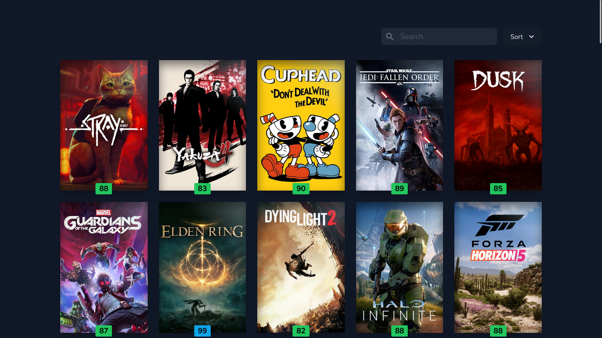

<div>
    <h1>Completed Games</h1>
    <div align="center">
        
        <sub>Collection of video games I've played over the years.</sub>
    </div>
</div>


# 🚀 Quick Start

## 1. Clone

```sh
git clone https://github.com/MattJarman/completed-games.git && cd completed-games
```

## 2. Install

```sh
pnpm i
```

## 3. Secrets

This project uses [Contentful](https://www.contentful.com/) for its content, so all content models
will need to be implemented. Once done, you can copy the `.env.local.example` to `.env.local` and fill in
the environment variables for your Contentful space.

```sh
cp .env.local.example .env
```

## 4. Start

```sh
pnpm run dev
```

The site should now be accessible on `localhost:3000`.
